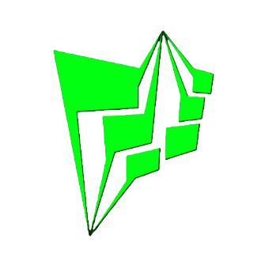

  

<h1 align="center">Matrix Kova</h1>

  <b>The Hybrid AI Workstation for Local Agents.</b> 
  A high-performance desktop environment designed for seamless orchestration between local silicon and cloud neural links.

  
  
  

---

## ⚡ Capabilities

Matrix Kova is not just a chatbot; it's a hardware-aware workstation built for production-grade AI interactions.

### 🧠 Hybrid Neural Engine
Toggle instantly between **Local AI Cores** (running purely on your hardware for 100% privacy via llama.cpp) and **Cloud Neural Links** (Groq LPU) for lightning-fast reasoning at 800+ tokens/sec.

### 🛠️ Autonomous Tool Orchestration
The built-in Orchestration Engine allows the agent to plan and execute multi-step file system operations. It can read, write, and manage local project structures iteratively while keeping you in the loop.

### 🛰️ Neural Registry Manager
Browse and deploy the latest GGUF models directly from the app. The workstation handles background downloads, model verification, and dynamic registry updates from the Matrix cloud.

### 🛡️ Hardware-Aware Autopilot
Intelligent resource management that performs real-time RAM audits and CPU thread scaling. Kova optimizes itself for your specific silicon to prevent OOM crashes and thermal throttling.

### ☁️ Cloud Sync Gateway
Secure Google Drive integration allows for seamless database backups and cross-device recovery. Your neural identity and chat history are always encrypted and under your control.

### 👤 Neural Identity Layer
Personalize your workstation with custom system directives and identity profiles. Shape the agent's tone, role, and implicit preferences to match your specific workflow.

---

## 📋 System Requirements

*   **OS:** Windows 10/11 (x64)
*   **Memory:** 8GB RAM (16GB Recommended for 8B+ Local Models)
*   **Processor:** Modern Multi-core CPU with AVX2 support
*   **Storage:** 500MB for core engine + space for local model weights (GGUF)

---

## 🌐 Connect with Matrix Forge

*   **Website:** [matrixx-forge.vercel.app](https://matrixx-forge.vercel.app)
*   **Contact:** [Neural Uplink (Contact Requests)](https://matrixx-forge.vercel.app/contact)

---

   
  <b>Built with 💚 by MatrixForge Engineering</b> 
  <i>"The future isn't automated. It's orchestrated."</i>

